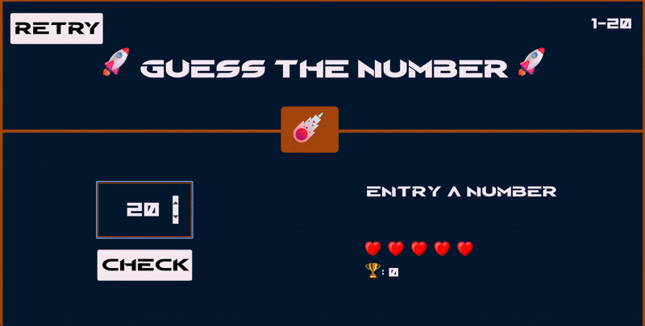

# Guess The Number 🚀



Bu proje, klasik sayı tahmin oyununun modern ve görsel olarak zenginleştirilmiş bir web uyarlamasıdır. Vanilla JavaScript kullanılarak geliştirilmiş olup, oyuncunun 1-20 arasındaki sayıyı hakları bitmeden tahmin etmesi üzerine kuruludur.

## 🌟 Özellikler

*   **Tahmin Mekanizması:** 1-20 arasında rastgele üretilen sayıyı bulma (Low/High yönlendirmeleri ile).
*   **Can (Lives) Sistemi:** 5 hakla sınırlı oyun yapısı, görsel kalp grafikleri ile kalan hak gösterimi.
*   **Anlık Geri Bildirim:** Tahminlere göre "Arttır (Increase)" veya "Azalt (Reduce)" yönlendirmeleri.
*   **Görsel Arayüz:** Kazanma/Kaybetme durumlarına göre değişen arka plan renkleri (Yeşil/Siyah) ve mesajlar.
*   **Skor Takibi:** Kazanılan oyunda kalan can sayısına göre skor belirleme.
*   **Yeniden Oynama:** Tek tuşla oyunu sıfırlama (Retry) özelliği.

## 🛠 Kullanılan Teknolojiler ve Yöntemler

*   **Core:** HTML5, CSS3, JavaScript
*   **Game Logic:** `Math.random()` ile rastgele sayı üretimi, DOM manipülasyonu ile interaktif akış.
*   **Event Handling:** `click` eventleri ile kullanıcı etkileşimi kontrolü.
*   **Assets:** Görsel zenginlik için ikon ve resim kullanımı (`img/` klasörü).

## 📂 Proje Yapısı

```
/
├── fonts/          # Font dosyaları
├── img/            # Görsel varlıklar (Roket, Kalp vb.)
├── index.html      # Ana Oyun Sayfası
├── style.css       # Stil Dosyası
└── app.js          # Oyun Mantığı ve DOM Kontrolü
```

## 🚀 Kurulum

Proje statik dosyalardan oluştuğu için herhangi bir kuruluma (npm install vb.) ihtiyaç duymaz.
1. Projeyi indirin.
2. `index.html` dosyasını tarayıcınızda açın veya VS Code **Live Server** eklentisi ile çalıştırın.
